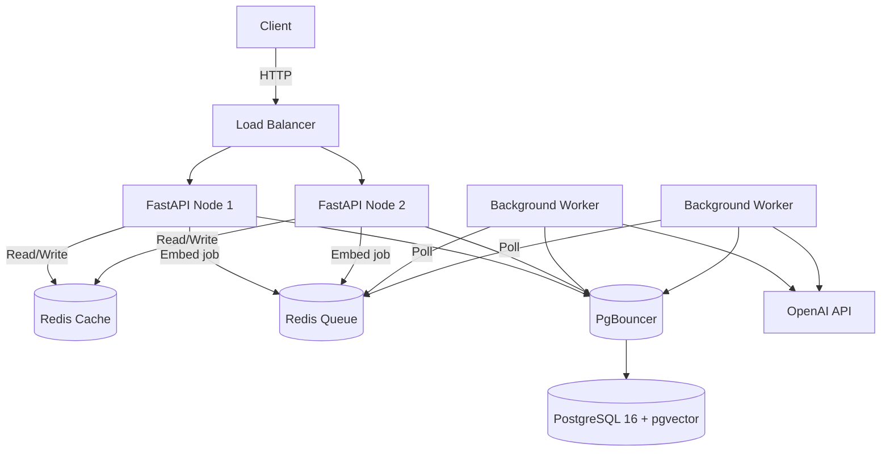

# 🤖 AI Knowledge Assistant API

A **production-grade Retrieval-Augmented Generation (RAG) API** built with FastAPI, PostgreSQL + pgvector, and OpenAI. Upload documents, ask questions, and get AI-generated answers grounded in your content.

---

## ✨ Features

- 📄 **Document Upload** — PDF, DOCX, and TXT file support
- 🔍 **Vector Search** — Cosine similarity search using `pgvector`
- 🤖 **LLM Answers** — GPT-4o-mini for contextual, grounded responses
- 🔐 **API Key Auth** — Secure all endpoints with `X-API-Key` header
- 🧱 **Clean Architecture** — Services, repositories, schemas clearly separated
- 🐳 **Docker-Ready** — One command to start everything: `docker compose up --build`
- 📊 **Structured Logging** — Request ID tracing on every log line
- ✅ **80%+ Test Coverage** — Pytest with async mocks

---

## 📁 Project Structure

```
app/
├── api/
│   ├── routes/         # health.py, documents.py, ask.py
│   ├── dependencies/   # providers.py (DI factory functions)
├── core/
│   ├── config.py       # Pydantic Settings from .env
│   ├── security.py     # API Key auth + input sanitization
│   ├── logging.py      # Structured logging + request_id context
├── services/
│   ├── embedding_service.py  # OpenAI text-embedding-3-small
│   ├── llm_service.py        # GPT-4o-mini completion
│   ├── retrieval_service.py  # Vector similarity search orchestration
│   ├── document_service.py   # Parse, chunk, embed, store
├── repositories/
│   ├── document_repository.py  # SQLAlchemy 2.0 async CRUD + pgvector queries
├── db/
│   ├── session.py      # Async engine + connection pooling
│   ├── models.py       # Document + DocumentChunk SQLAlchemy models
├── schemas/
│   ├── document.py, ask.py, health.py, error.py
├── utils/
│   ├── cache.py        # BaseCache, RedisCache, InMemoryCache
│   ├── queue.py        # BaseQueue, BackgroundTasksQueue, RedisQueue
└── main.py             # App factory, middleware, global error handlers
migrations/
├── versions/           # Alembic migration scripts
tests/
├── conftest.py         # Fixtures + mock services
├── test_health.py
├── test_documents.py
├── test_ask.py
├── test_services.py
```

---

## 🏗️ Architecture Diagram



---

## 🚀 Quick Start

### Prerequisites

- Docker & Docker Compose installed
- An OpenAI API Key

### 1. Clone & Configure

```bash
git clone <your-repo-url>
cd ai-knowledge-assistant

# Copy the environment template
cp .env.example .env
```

Edit `.env` and set your values:

```env
OPENAI_API_KEY=sk-...
API_KEY=your-strong-secret-key
```

### 2. Start with Docker Compose

```bash
docker compose up --build
```

This will automatically:
1. Start PostgreSQL 16 with pgvector extension
2. Start Redis
3. Run Alembic migrations (creates tables + vector index)
4. Start FastAPI API on port 8000

### 3. Verify it's running

```bash
curl http://localhost:8000/health
```

Expected response:
```json
{
  "status": "healthy",
  "database": "connected",
  "llm": "available"
}
```

---

## 📡 API Endpoints

All endpoints except `/health` require `X-API-Key` header.

### Health Check
```http
GET /health
```

### Upload a Document
```http
POST /documents/upload
X-API-Key: your-api-key
Content-Type: multipart/form-data

file=@document.pdf
```

Response:
```json
{
  "document_id": "uuid",
  "chunks_created": 42
}
```

### List Documents
```http
GET /documents
X-API-Key: your-api-key
```

### Get Document by ID
```http
GET /documents/{id}
X-API-Key: your-api-key
```

### Delete a Document
```http
DELETE /documents/{id}
X-API-Key: your-api-key
```

### Ask a Question
```http
POST /ask
X-API-Key: your-api-key
Content-Type: application/json

{
  "question": "What is the refund policy?"
}
```

Response:
```json
{
  "answer": "The refund policy states that...",
  "sources": [
    {
      "document": "policy.pdf",
      "chunk": "...relevant text excerpt..."
    }
  ]
}
```

---

## 🔐 Authentication

All protected endpoints use an `X-API-Key` HTTP header:

```bash
curl -H "X-API-Key: your-api-key" http://localhost:8000/documents
```

Error on missing/invalid key:
```json
{
  "success": false,
  "error": {
    "code": "UNAUTHORIZED",
    "message": "Invalid or missing API key."
  }
}
```

---

## 🌍 Environment Variables

| Variable | Required | Default | Description |
|----------|----------|---------|-------------|
| `OPENAI_API_KEY` | ✅ | — | OpenAI API key for embeddings & LLM |
| `API_KEY` | ✅ | `default-secret-key` | Authentication key for `X-API-Key` header |
| `DATABASE_URL` | ✅ | `postgresql+asyncpg://...` | Full async PostgreSQL connection string |
| `POSTGRES_USER` | — | `postgres` | PostgreSQL user (Docker Compose) |
| `POSTGRES_PASSWORD` | — | `postgrespassword` | PostgreSQL password (Docker Compose) |
| `POSTGRES_DB` | — | `rag_db` | PostgreSQL database name (Docker Compose) |
| `REDIS_URL` | — | `redis://localhost:6379/0` | Redis connection URL |
| `ENABLE_REDIS` | — | `false` | Set to `true` to activate Redis cache/queue |
| `MAX_FILE_SIZE_MB` | — | `10` | Maximum upload file size in megabytes |
| `CHUNK_SIZE` | — | `500` | Characters per chunk during text splitting |
| `CHUNK_OVERLAP` | — | `50` | Overlap characters between adjacent chunks |

---

## 🏃 Local Development (without Docker)

```bash
# Create virtual environment
python -m venv .venv
source .venv/bin/activate  # or .venv\Scripts\activate on Windows

# Install dependencies
pip install -r requirements.txt

# Set environment variables
cp .env.example .env
# Edit .env with your values

# Run migrations
alembic upgrade head

# Start API
uvicorn app.main:app --host 0.0.0.0 --port 8000 --reload
```

---

## 🧪 Running Tests

```bash
# Install test dependencies (included in requirements.txt)
pip install -r requirements.txt

# Run all tests with coverage
pytest

# Run specific test file
pytest tests/test_documents.py -v
```

Coverage report will be generated in `htmlcov/index.html`.

---

## ☁️ Deployment

### Railway

1. Create a new Railway project
2. Add a **PostgreSQL** plugin — Railway automatically sets `DATABASE_URL`
3. Add a **Redis** plugin — sets `REDIS_URL`
4. Connect your GitHub repo
5. Set environment variables in the Railway dashboard:
   - `OPENAI_API_KEY`
   - `API_KEY`
   - `ENABLE_REDIS=true`
6. Set Start Command: `alembic upgrade head && uvicorn app.main:app --host 0.0.0.0 --port $PORT`

> **Note:** Railway's PostgreSQL does **not** include pgvector by default. Use the `pgvector/pgvector:pg16` Docker image or a managed service like Supabase (which includes pgvector).

### Render

1. Create a new **Web Service** on Render
2. Connect your GitHub repository
3. Set **Build Command**: `pip install -r requirements.txt`
4. Set **Start Command**: `alembic upgrade head && uvicorn app.main:app --host 0.0.0.0 --port $PORT`
5. Add environment variables:
   - `OPENAI_API_KEY`
   - `API_KEY`
   - `DATABASE_URL` — use Render's PostgreSQL service or external DB with pgvector
6. Create a **PostgreSQL** database on Render and link it

> **Note:** Render's managed PostgreSQL supports `pgvector`. Enable it by running `CREATE EXTENSION vector;` in the DB console once.

---

## 📖 API Documentation

Interactive OpenAPI documentation is available at:

- **Swagger UI**: `http://localhost:8000/docs`
- **ReDoc**: `http://localhost:8000/redoc`
- **OpenAPI JSON**: `http://localhost:8000/openapi.json`

---

## 📊 Observability

Every API request includes:

- `X-Request-ID` response header — unique trace ID
- `X-Process-Time-Ms` response header — request latency in milliseconds
- Structured log lines with `[request_id]` injected into every log entry

---

## ⚡ Scalability Design

| Concern | Solution |
|---------|----------|
| Stateless API | No in-process state, fully async FastAPI |
| Connection Pooling | SQLAlchemy `pool_size=20`, `max_overflow=30` |
| Vector Search | pgvector IVFFlat index with `lists=100` |
| Cache Layer | Redis (or in-memory fallback) abstraction |
| Queue Layer | `BackgroundTasksQueue` (pluggable with Redis/Celery) |
| Horizontal Scaling | Stateless; deploy multiple replicas behind a load balancer |

---

## 🛡️ Security

- All secrets via environment variables — never hardcoded
- API Key authentication on every protected endpoint
- Input sanitization (null bytes stripped, whitespace normalized)
- File type validation (PDF, DOCX, TXT only)
- File size enforcement (configurable, default 10 MB)
- CORS middleware (configure `allow_origins` for production)
- Non-root Docker user (`appuser`)

---

## 📜 License

MIT
